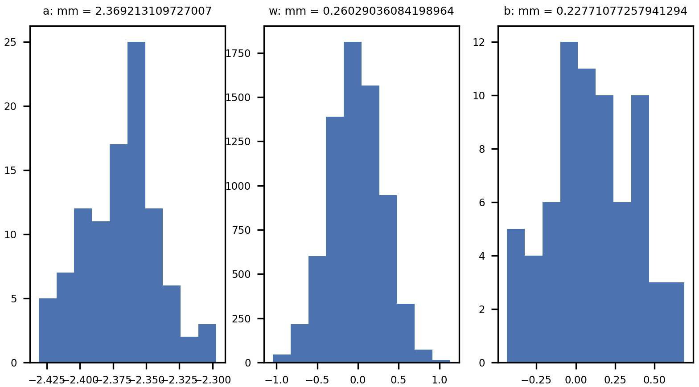
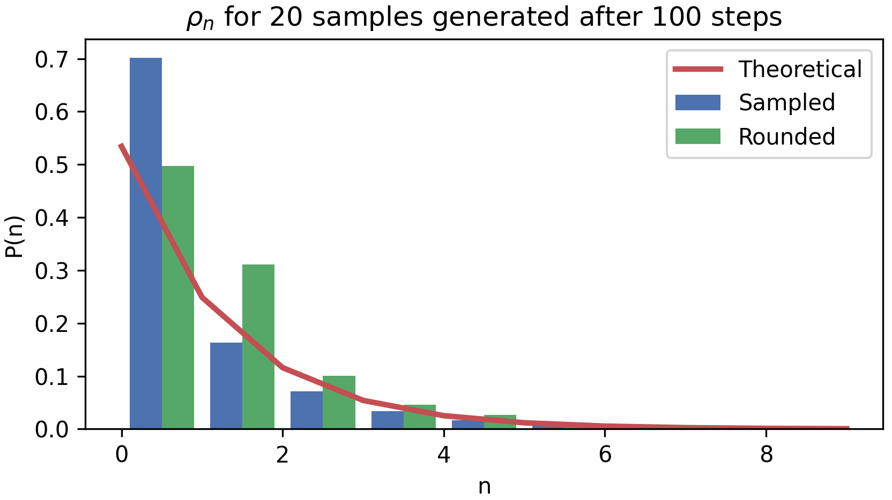

# On the statistics of a set of quantum mechanical harmonic oscillators. A machine learning approach.

This is the code of my final mini-project presented for the online course ["Machine Learning for Physicists 2020"](https://pad.gwdg.de/s/HJtiTE__U) offered by the University of Erlangen-Nuremberg and lectured by Florian Marquardt during the COVID-19 lockdown.

## Description

A Gaussian-Bernoulli Restricted Boltzmann Machine is trained to learn and reproduce the statistics of a set of `100` quantum mechanical harmonic oscillators at thermal equilibrium and fixed frequency. Thermodynamic quantities are computed as ensemble averages from the generated samples and compared to the theoretical values as a means of validation.

The neural network is fed with `300,000` samples of sets of these oscillators (generated with a Monte Carlo approach) as a Gaussian layer. The quantum numbers that define the state of the oscillators are normalized to 1 considering that, given the conditions arbitrarily set for the temperature and frequency, capping the generator to a maximum quantum number of `n_max=10` is enough to capture the physics of these ensembles.

To install and train the neural network, run:

```
$ pip install -r requirements.txt
$ cd miniproject
$ python train.py
```

## Results

The neural network was defined according to the guidelines described in Geoffrey Hinton's ["A Practical Guide to Training Restricted Boltzmann Machines (Version 1)"](https://www.cs.toronto.edu/~hinton/absps/guideTR.pdf) and the set of hyper-parameters chosen is:

* amount of hidden units = 70
* batchsize = 10
* learning rate = 0.005
* no momentum, weight-decay nor sparse targets

After `300,000` training steps using contrastive divergence, the final state of the neural network (which can be found at `/miniproject/data/`) can be pictured with the histogram of weights and biases:



And the generated probability distribution, along with the thermodynamic quantities calculated from the generated samples, are:




|  | Theoretical   | Sampled  |  Rounded  |
| ------ | ------- |:-------------:| -----:|
| < E > | 1.4471307636e-26 | 1.441212123e-26 | 1.3788526515e-26 |
| <\epsilon_n> | 1.4471307636e-28 | 1.4412121231e-28 | 1.3788526515e-28 |
| < n > | 0.872244867016 | 0.866632503412 | 0.8075 |


Where two approaches are considered:

1. Taking the `Sampled` quantum numbers generated by the Gaussian layer of the RBM. These can take any value from 0 to 1.
2. Denormalizing these sampled values and considering the `Rounded` values of these quantum numbers (to the closest integer) to get a "more physical result".

Which can be reproduced by running:

```
$ cd miniproject
$ python results.py
```

## License

Licensed under the [MIT License](https://github.com/peguerosdc/ml4phy-quantum-oscillators/blob/master/LICENSE).